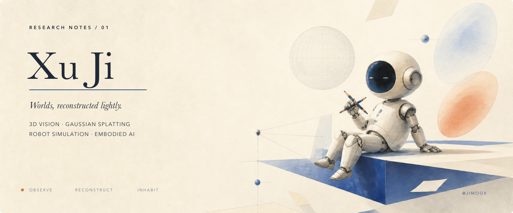
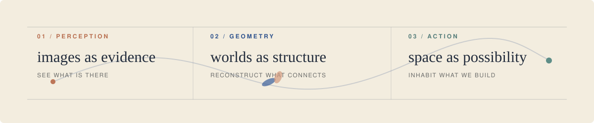

  

<table>
  <tr>
    <td width="60%" valign="top">
      ABOUT / 01
      <h2>A quiet practice.</h2>
      

        I reconstruct worlds from images, mostly out of curiosity.
        Some become papers; some become simulations; some simply remain interesting.
      

    </td>
    <td width="40%" valign="top">
      PROFILE / XJ
      <h3>Xu Ji</h3>
      
3D vision researcher

      
<code>3D Vision</code> <code>Gaussian Splatting</code> <code>Robot Simulation</code> <code>Embodied AI</code>

      

        <a href="https://scholar.google.com/citations?user=5FFByFQAAAAJ&hl=en">Scholar ↗</a>
        &nbsp;&nbsp;
        <a href="https://orcid.org/0009-0006-7819-7853">ORCID ↗</a>
      

    </td>
  </tr>
</table>

 

  

 

<table>
  <tr>
    <td width="16%" valign="top">
      SELECTED WORK
      <h1>01</h1>
    </td>
    <td width="66%" valign="top">
      POSE-GUIDED GEOMETRY · FEED-FORWARD 3DGS
      <h3>Pose-Guided Geometric Refinement for Feed-Forward 3D Gaussian Splatting</h3>
      
Geometry-aware refinement for more reliable feed-forward reconstruction.

      Zihan Wang, <b>Xu Ji</b>, Yejun Zhang, Esa Rahtu, Juho Kannala
    </td>
    <td width="18%" align="center" valign="middle">
      ICPR 2026
        
      <a href="https://doi.org/10.1007/978-3-032-31920-3_15"><b>READ ↗</b></a>
    </td>
  </tr>
  <tr>
    <td width="16%" valign="top">
      WORKSHOP WORK
      <h1>02</h1>
    </td>
    <td width="66%" valign="top">
      POSE-FREE NVS · GAUSSIAN GEOMETRY
      <h3><a href="https://arxiv.org/abs/2608.16863">SplatGuide</a></h3>
      
Gaussian geometry × pose-free novel-view synthesis.

      Preprint available on arXiv.
    </td>
    <td width="18%" align="center" valign="middle">
      ECCV 2026 WORKSHOP
        
      <a href="https://arxiv.org/abs/2608.16863"><code>READ ↗</code></a>
    </td>
  </tr>
</table>

 

  <i>Some days, a paper. Some days, a simulation. Always curiosity.</i>

  Xu Ji · @JimooX

